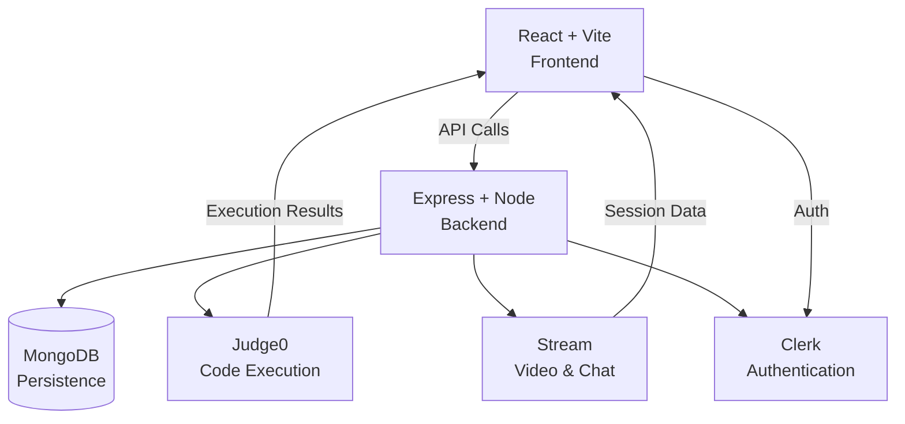

# CodeArena

A coding practice platform where you solve problems, run code instantly, and practice with others through video sessions.
<br> <br>


<br><br>


## What is this?

CodeArena is a browser-based environment for practicing coding problems. Pick a problem, write your solution in JavaScript, Python, or Java, run it to test your logic, and submit when you're ready. If you get stuck, you can collaborate with others in a live session and compare approaches in real time.

The platform stores your submissions so you can track your progress and revisit past solutions. Your profile shows your activity and submission history.

## What can I do here?

### Practice

Browse a library of coding challenges, open a problem, and work through the description, examples, and constraints in the browser.

### Run and test

Write your solution in Monaco, run it, and compare the output against the expected result. It's a quick loop for problem solving and debugging.

### Submit

When you're ready, submit your code and keep a record of the result. Accepted, wrong answer, runtime error, and compilation issues all appear in your submission history.

### Practice together

Create or join a session and use Stream video/chat while working through problems with another user.

## How it works

CodeArena is built as a React frontend and Express backend. The frontend is the coding environment: problem view, editor, output panel, and session UI. The backend handles auth, MongoDB persistence, code execution, and session orchestration.

For execution, the app sends code to Judge0 and returns the output. The problem page compares that output with the expected output stored in the frontend problem data. When you submit, the backend stores the result in MongoDB and displays it in your history.



## Built with

**Frontend**  
React 19, TypeScript, Vite, React Router, TanStack Query, Monaco Editor, Tailwind CSS, DaisyUI

**Backend**  
Node.js, TypeScript, Express 5, MongoDB, Mongoose

**Services**  
Clerk, Judge0, Stream, Inngest

## Running locally

### Install

```bash
npm install --prefix backend
npm install --prefix frontend
```

### Configure environment variables

You need your own local credentials for the backend and frontend. Keep secrets on the backend and never expose them through `VITE_*` variables.

Backend environment variables used by the app include:

```bash
PORT=3000
DB_URL=your_mongodb_connection_string
NODE_ENV=development
CLIENT_URL=http://localhost:5173
CLERK_PUBLISHABLE_KEY=pk_...
CLERK_SECRET_KEY=sk_...
STREAM_API_KEY=your_stream_key
STREAM_API_SECRET=your_stream_secret
INNGEST_EVENT_KEY=your_inngest_key
INNGEST_SIGNING_KEY=your_inngest_signing_key
```

Frontend variables:

```bash
VITE_CLERK_PUBLISHABLE_KEY=pk_...
VITE_STREAM_API_KEY=your_stream_key
VITE_API_URL=http://localhost:3000
```

There is currently no `.env.example` in the repo, and `.env` files should not be committed.

### Start the app

Backend:

```bash
npm run dev --prefix backend
```

Frontend:

```bash
npm run dev --prefix frontend
```

The backend usually runs on port 3000 and the frontend on 5173.

## Current limitations

Some parts are still intentionally limited in the current version:

- Hidden-test judging is not implemented.
- Submission execution currently sends empty stdin, so input-driven problems are limited.
- Code is not synchronized between users in a session.
- There is no winner or battle outcome system.
- There is no automated test suite.
- There is a known session difficulty mismatch: the frontend sends `"medium"`, while the backend expects `"moderate"`.
- Viewing another user's profile has a known caveat around submissions fetching.

## Contributing

Contributions are welcome. Detailed contributor guidance will live in `CONTRIBUTING.md` when it exists.

## License

This repository does not currently include a license file. Please check the repository before reusing the code under a specific license.

---

**Have a bug or idea?** Open an issue on [GitHub](https://github.com/Rishiraj029/CodeArena/issues).
