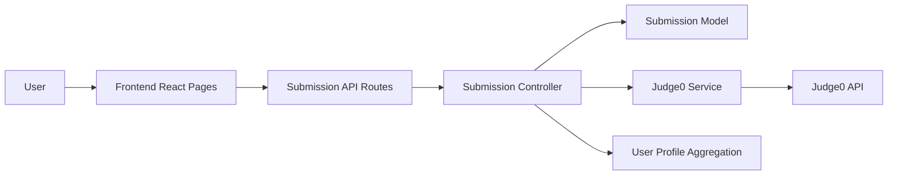
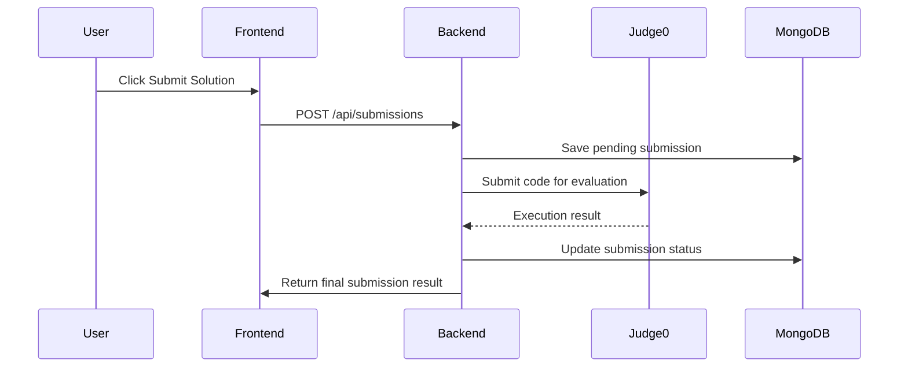

# Submission Tracking and Public User Profiles

## Overview

This document describes a proposed feature for CodeArena: permanently storing official code submissions and exposing structured user profile statistics.

The goal is to extend the existing competitive coding experience so that:

- every official submission is stored in the database
- users can view their own submission history
- users can inspect a single submission in detail
- public user profiles can show solved-problem statistics and activity
- future ranking, contest, and battle systems can reuse the same submission model

This document is based on the current repository state and only describes the planned feature. No production code is modified here.

---

## 1. Existing Project Context

### 1.1 Current folder structure

The repository currently contains:

- [backend](../backend)
  - [backend/src/server.js](../backend/src/server.js)
  - [backend/src/routes](../backend/src/routes)
  - [backend/src/controllers](../backend/src/controllers)
  - [backend/src/models](../backend/src/models)
  - [backend/src/middleware](../backend/src/middleware)
  - [backend/src/lib](../backend/src/lib)

- [frontend](../frontend)
  - [frontend/src/pages](../frontend/src/pages)
  - [frontend/src/components](../frontend/src/components)
  - [frontend/src/hooks](../frontend/src/hooks)
  - [frontend/src/api](../frontend/src/api)
  - [frontend/src/lib](../frontend/src/lib)
  - [frontend/src/data](../frontend/src/data)

### 1.2 Frontend framework and routing

The frontend uses:

- React
- Vite
- React Router DOM
- TanStack React Query
- Tailwind CSS + DaisyUI
- Clerk for authentication
- Monaco Editor for code editing

The routing is defined in [frontend/src/App.jsx](../frontend/src/App.jsx) using `Routes` and `Route` from `react-router-dom`.

Current routes include:

- `/`
- `/dashboard`
- `/problems`
- `/problem/:id`
- `/session/:id`

### 1.3 Backend architecture

The backend is an Express application in [backend/src/server.js](../backend/src/server.js).

It currently mounts:

- `/api/inngest` for Clerk sync/webhook-like automation
- `/api/chat` for Stream chat token generation
- `/api/sessions` for session management
- `/api` for Judge0 execution

The backend uses modular files:

- routes for endpoint definitions
- controllers for business logic
- models for MongoDB schema
- middleware for authentication
- helper modules for services such as DB and Stream integration

### 1.4 Database and ORM

The project uses MongoDB with Mongoose.

Database connection is established in [backend/src/lib/db.js](../backend/src/lib/db.js).

Current data models are:

- [backend/src/models/User.js](../backend/src/models/User.js)
- [backend/src/models/Session.js](../backend/src/models/Session.js)

### 1.5 Authentication system

Authentication is handled with Clerk.

Relevant pieces:

- [backend/src/middleware/protectRoute.js](../backend/src/middleware/protectRoute.js)
- [frontend/src/main.jsx](../frontend/src/main.jsx)

The backend middleware verifies the Clerk token and loads the user from the MongoDB `User` collection.

### 1.6 Existing user model

The current user model in [backend/src/models/User.js](../backend/src/models/User.js) stores:

- `name`
- `email`
- `profileImage`
- `clerkId`
- timestamps

This is the existing identity model that will be extended for profile statistics.

### 1.7 Existing problem model

There is no database-backed problem model right now.

Problems are currently defined as static frontend data in [frontend/src/data/problems.js](../frontend/src/data/problems.js).

This means:

- problem metadata lives in the frontend
- the backend does not currently have a persisted problem collection
- future submissions should reference a problem identifier, but the current architecture will need a clear mapping strategy

### 1.8 Judge0 integration

Judge0 execution is handled in [backend/src/controllers/judge0Controller.js](../backend/src/controllers/judge0Controller.js).

The current flow calls Judge0 with:

- source code
- language ID
- empty stdin

The current implementation returns:

- success flag
- output
- error

### 1.9 Monaco Editor integration

The Monaco editor is used in:

- [frontend/src/components/CodeEditorPanel.jsx](../frontend/src/components/CodeEditorPanel.jsx)
- [frontend/src/pages/ProblemPage.jsx](../frontend/src/pages/ProblemPage.jsx)
- [frontend/src/pages/SessionPage.jsx](../frontend/src/pages/SessionPage.jsx)

The editor allows users to:

- select a language
- edit code
- run code
- view output

### 1.10 Current code-submission flow

There is currently no formal submission-recording system.

The current flow is basically:

1. user edits code in Monaco Editor
2. user selects language
3. user clicks Run Code
4. frontend calls the `executeCode` helper
5. frontend sends a request to `/api/execute`
6. backend calls Judge0
7. output is returned to the frontend
8. frontend displays the result in [frontend/src/components/OutputPanel.jsx](../frontend/src/components/OutputPanel.jsx)

### 1.11 Session and battle-related models

Sessions are stored in [backend/src/models/Session.js](../backend/src/models/Session.js).

Current session fields include:

- `problem`
- `difficulty`
- `host`
- `participant`
- `status`
- `callId`

This makes sessions the closest existing concept to a battle or match container.

### 1.12 API routes and server actions

The project uses Express routes rather than server actions.

Relevant routes:

- [backend/src/routes/sessionRoutes.js](../backend/src/routes/sessionRoutes.js)
- [backend/src/routes/chatRoutes.js](../backend/src/routes/chatRoutes.js)
- [backend/src/routes/judge0Routes.js](../backend/src/routes/judge0Routes.js)

### 1.13 State management approach

The frontend uses:

- local component state (`useState`)
- React Router params
- TanStack Query for server data

The main data-fetching hook file is [frontend/src/hooks/useSessions.js](../frontend/src/hooks/useSessions.js).

### 1.14 Validation and error handling patterns

The current backend uses simple validation and error responses such as:

- `400` for bad input
- `404` for not found
- `409` when a session is full
- `500` for internal errors

The current frontend uses toast notifications for user-facing errors via `react-hot-toast`.

### 1.15 UI component conventions

The project uses a component-based structure with relatively focused files such as:

- [frontend/src/components/CodeEditorPanel.jsx](../frontend/src/components/CodeEditorPanel.jsx)
- [frontend/src/components/OutputPanel.jsx](../frontend/src/components/OutputPanel.jsx)
- [frontend/src/components/Navbar.jsx](../frontend/src/components/Navbar.jsx)
- [frontend/src/components/ProblemDescription.jsx](../frontend/src/components/ProblemDescription.jsx)

The styling convention is Tailwind + DaisyUI, and the project uses custom color and visual patterns centered on a dark theme.

### 1.16 Naming conventions used in the project

The repository uses:

- camelCase for JavaScript functions and variables
- `useX` naming for hooks
- `XPage` naming for page components
- `XPanel` naming for UI sections
- `sessionApi` style object for API wrappers

---

## 2. Current Run Code Flow

The current implementation does not yet distinguish between “run” and “submit”.

### 2.1 Current user action flow

1. User opens a problem page
   - [frontend/src/pages/ProblemPage.jsx](../frontend/src/pages/ProblemPage.jsx)
   - [frontend/src/pages/SessionPage.jsx](../frontend/src/pages/SessionPage.jsx)

2. User writes code in the Monaco editor
   - [frontend/src/components/CodeEditorPanel.jsx](../frontend/src/components/CodeEditorPanel.jsx)

3. User selects a language
   - managed by local state in the page component

4. User clicks “Run Code”
   - controlled by `handleRunCode` in [frontend/src/pages/ProblemPage.jsx](../frontend/src/pages/ProblemPage.jsx) and [frontend/src/pages/SessionPage.jsx](../frontend/src/pages/SessionPage.jsx)

5. The frontend calls `executeCode`
   - [frontend/src/lib/piston.js](../frontend/src/lib/piston.js)

6. The frontend sends a POST request to `/api/execute`
   - proxied by Vite to `http://localhost:3000` in [frontend/vite.config.js](../frontend/vite.config.js)

7. The backend runs Judge0 through [backend/src/controllers/judge0Controller.js](../backend/src/controllers/judge0Controller.js)

8. The result is returned and rendered in [frontend/src/components/OutputPanel.jsx](../frontend/src/components/OutputPanel.jsx)

### 2.2 Current execution logic

The current frontend uses the problem’s expected output and compares it locally to decide whether the test cases passed.

That logic is in [frontend/src/pages/ProblemPage.jsx](../frontend/src/pages/ProblemPage.jsx):

- `normalizeOutput`
- `checkIfTestsPassed`

This means the current app uses a basic “local verification” approach based on frontend-provided expected outputs from [frontend/src/data/problems.js](../frontend/src/data/problems.js).

### 2.3 Difference between current Run Code and future Submit Solution

Current behavior:

- executes code against the current problem’s sample or demo cases
- shows output and a success/failure toast
- does not create a persistent submission record
- does not update user statistics
- does not affect profile data

Future behavior:

- execution should be tied to official hidden tests
- a permanent submission should be stored
- statistics should be updated
- history and public profile sections should reflect the result

The current codebase is therefore missing the persistence and profile integration layer for official submissions.

---

## 3. Proposed Feature Definition

The new feature should allow CodeArena to permanently store every official solution submission.

Each submission should contain information such as:

- `submissionId`
- `userId`
- `problemId`
- `sessionId` or `battleId` when relevant
- `sourceCode`
- `language`
- `judge0LanguageId`
- `status`
- `executionTime`
- `memoryUsage`
- `judge0Token`
- `compilerOutput`
- `stdout`
- `stderr`
- `passedTestCount`
- `totalTestCount`
- `submissionType`
- `submittedAt`
- `createdAt`
- `updatedAt`

Possible submission types should include:

- `individual_practice`
- `session_battle`
- `contest`
- `interview`

For the initial implementation, the system can support:

- individual practice
- existing session battles

The model should still be extensible for future contest and interview features.

---

## 4. Recommended Database Design

### 4.1 Proposed collection/model

A new Mongoose model should be added, likely named `Submission`.

This should live in:

- [backend/src/models](../backend/src/models)

### 4.2 Why this model is needed

The current app has no official submission storage. Without a submission model:

- there is no historical record of user solutions
- there is no reusable data source for profiles or rankings
- battle outcomes cannot be tied to the underlying solution data
- future contest systems have no stable base model

### 4.3 Proposed schema example

The following is a proposed Mongoose-style schema consistent with the project’s current style:

```js
import mongoose from "mongoose";

const submissionSchema = new mongoose.Schema(
  {
    user: {
      type: mongoose.Schema.Types.ObjectId,
      ref: "User",
      required: true,
      index: true,
    },
    problemId: {
      type: String,
      required: true,
      index: true,
    },
    problemTitle: {
      type: String,
      default: "",
    },
    session: {
      type: mongoose.Schema.Types.ObjectId,
      ref: "Session",
      default: null,
      index: true,
    },
    battleId: {
      type: String,
      default: null,
      index: true,
    },
    sourceCode: {
      type: String,
      required: true,
    },
    language: {
      type: String,
      required: true,
      enum: ["javascript", "python", "java"],
      default: "javascript",
    },
    judge0LanguageId: {
      type: Number,
      required: true,
    },
    status: {
      type: String,
      required: true,
      enum: [
        "pending",
        "processing",
        "accepted",
        "wrong_answer",
        "time_limit_exceeded",
        "compilation_error",
        "runtime_error",
        "memory_limit_exceeded",
        "internal_error",
      ],
      default: "pending",
      index: true,
    },
    executionTime: {
      type: Number,
      default: null,
    },
    memoryUsage: {
      type: Number,
      default: null,
    },
    judge0Token: {
      type: String,
      default: "",
    },
    compilerOutput: {
      type: String,
      default: "",
    },
    stdout: {
      type: String,
      default: "",
    },
    stderr: {
      type: String,
      default: "",
    },
    passedTestCount: {
      type: Number,
      default: 0,
    },
    totalTestCount: {
      type: Number,
      default: 0,
    },
    submissionType: {
      type: String,
      required: true,
      enum: ["individual_practice", "session_battle", "contest", "interview"],
      default: "individual_practice",
      index: true,
    },
    isPublic: {
      type: Boolean,
      default: false,
    },
    isOfficial: {
      type: Boolean,
      default: true,
    },
    isAccepted: {
      type: Boolean,
      default: false,
      index: true,
    },
    submittedAt: {
      type: Date,
      default: Date.now,
      index: true,
    },
  },
  { timestamps: true }
);

submissionSchema.index({ user: 1, problemId: 1, isAccepted: 1 });
submissionSchema.index({ submittedAt: -1 });
submissionSchema.index({ status: 1, submissionType: 1 });

const Submission = mongoose.model("Submission", submissionSchema);

export default Submission;
```

### 4.4 Recommended fields and why they are needed

#### Required core fields

- `user`: ties the submission to an authenticated account
- `problemId`: allows profile and history queries by problem
- `sourceCode`: needed for submission details page
- `language`: required for display and filtering
- `judge0LanguageId`: needed so Judge0 requests can be made correctly
- `status`: required to represent the current state of execution
- `submissionType`: needed to support different product modes

#### Execution/result fields

- `executionTime` and `memoryUsage`: useful for detailed submission pages
- `stdout`, `stderr`, and `compilerOutput`: needed for debugging and display
- `passedTestCount` and `totalTestCount`: critical for acceptance and profile statistics

#### Relationship fields

- `session`: optional relation to existing session-based battles
- `battleId`: useful for future systems where a battle does not map cleanly to a MongoDB session ID

#### Visibility fields

- `isPublic`: allows public profile visibility control later
- `isOfficial`: distinguishes official submissions from temporary test runs

### 4.5 Enums

The implementation should use enums or string constants for:

- language
- status
- submission type

This keeps the system normalized and easier to query.

### 4.6 Relationships with User

Each submission should reference the authenticated user via `user`.

This is the key relationship for:

- personal submission history
- profile statistics
- public profile pages

### 4.7 Relationships with Problem

Because the current repository does not yet have a persisted problem model, the initial implementation can use:

- `problemId` as a string reference to the frontend problem identifier

This is the safest starting approach because the current problem data lives in [frontend/src/data/problems.js](../frontend/src/data/problems.js).

In the future, a real MongoDB `Problem` model can replace the string reference.

### 4.8 Optional relationship with Session or Battle

If a submission is created from a session battle, the schema should support:

- `session`
- `battleId`

This allows the system to later connect submissions to session-based matches without breaking the data model.

### 4.9 Default values, constraints, and indexes

Suggested defaults:

- `status`: `pending`
- `submissionType`: `individual_practice`
- `isPublic`: `false`
- `isOfficial`: `true`
- `passedTestCount`: `0`
- `totalTestCount`: `0`

Suggested indexes:

- `user + problemId + isAccepted`
- `submittedAt`
- `status + submissionType`

### 4.10 Cascade/deletion behavior

For the first implementation, a submission should not be deleted automatically when a user is removed.

Recommended approach:

- keep the submission record
- preserve it for history and profile data
- optionally mark it as orphaned or anonymized later

This is simpler and safer than cascading deletion for a feature like this.

---

## 5. Submission Status Design

### 5.1 Recommended internal status system

A normalized status system should be introduced for application-level logic.

Suggested statuses:

- `pending`
- `processing`
- `accepted`
- `wrong_answer`
- `time_limit_exceeded`
- `compilation_error`
- `runtime_error`
- `memory_limit_exceeded`
- `internal_error`

### 5.2 Mapping from Judge0 results

Judge0 responses should be mapped into these internal statuses.

Suggested mapping:

| Judge0-like result | Internal status |
| --- | --- |
| queued / processing | `pending` or `processing` |
| accepted | `accepted` |
| wrong_answer | `wrong_answer` |
| time_limit_exceeded | `time_limit_exceeded` |
| compilation_error | `compilation_error` |
| runtime_error | `runtime_error` |
| memory_limit_exceeded | `memory_limit_exceeded` |
| internal_error | `internal_error` |

### 5.3 Reuse opportunities from the current code

The current backend already has a single Judge0 execution controller in [backend/src/controllers/judge0Controller.js](../backend/src/controllers/judge0Controller.js).

That file can be refactored into a reusable service layer so it can support:

- run-only execution
- official submission execution
- polling logic
- final result processing

The existing logic should not be duplicated.

---

## 6. Run Code vs Submit Solution

### 6.1 Run Code behavior

The current “Run Code” flow should remain as a lightweight execution mode.

It should:

- use sample/custom input when available
- not count as an official submission
- not update solved-problem stats
- not affect profile data
- optionally be stored as temporary execution history later

### 6.2 Submit Solution behavior

The new “Submit Solution” flow should:

- run against hidden tests or official evaluation input
- create a persistent submission record
- mark the submission as official
- update problem-solving statistics
- appear in submission history
- influence battle result logic later
- eventually contribute to rankings/rating systems

### 6.3 Does the current problem structure support hidden tests?

Not in the current repository.

The current problems are static frontend content in [frontend/src/data/problems.js](../frontend/src/data/problems.js), and the current execution flow only checks the visible expected output from that file.

That means:

- hidden test support does not exist yet
- the system would need a more structured problem definition
- the backend would need a way to evaluate official tests separately from sample tests

### 6.4 Required changes for hidden tests

The future implementation would need:

- a problem definition structure that includes hidden test cases or a test suite
- a backend evaluation layer that can compare against official test data
- a distinction between sample-run execution and official submission execution

For the first version, the safest architecture is to separate the two flows even if hidden tests are only partially supported.

---

## 7. Proposed API and Server Architecture

### 7.1 Recommended backend structure

The following new files are recommended:

- [backend/src/controllers/submissionController.js](../backend/src/controllers/submissionController.js) — submission business logic
- [backend/src/routes/submissionRoutes.js](../backend/src/routes/submissionRoutes.js) — submission endpoints
- [backend/src/models/Submission.js](../backend/src/models/Submission.js) — submission data model
- [backend/src/lib/submissionService.js](../backend/src/lib/submissionService.js) — reusable submission processing logic

The existing files to reuse are:

- [backend/src/controllers/judge0Controller.js](../backend/src/controllers/judge0Controller.js)
- [backend/src/middleware/protectRoute.js](../backend/src/middleware/protectRoute.js)
- [backend/src/models/User.js](../backend/src/models/User.js)
- [backend/src/models/Session.js](../backend/src/models/Session.js)
- [backend/src/routes/judge0Routes.js](../backend/src/routes/judge0Routes.js)

### 7.2 Proposed endpoints

#### Create submission

- Purpose: create a pending official submission record
- Method: `POST`
- Route: `/api/submissions`
- Auth: required
- Request body:
  - `problemId`
  - `language`
  - `sourceCode`
  - `submissionType`
  - `sessionId` (optional)
  - `battleId` (optional)
- Response:
  - created submission object with pending status
- Validation:
  - user must be authenticated
  - problemId must be present
  - language must be supported
  - sourceCode must not be empty
- Authorization:
  - user can only create submissions for themselves
- Error cases:
  - unsupported language
  - missing code or problem
  - invalid session access

#### Execute submission

- Purpose: send a submission to Judge0 for execution
- Method: `POST`
- Route: `/api/submissions/:id/execute`
- Auth: required
- Request data:
  - submission ID
- Response:
  - updated submission object
- Validation:
  - submission must belong to the current user
- Authorization:
  - only owner can execute
- Error cases:
  - Judge0 failure
  - submission already completed

#### Poll Judge0 result

- Purpose: retrieve evaluation result after asynchronous processing
- Method: `GET`
- Route: `/api/submissions/:id/result`
- Auth: required
- Response:
  - latest Judge0 result and mapped submission status
- Validation:
  - only owner or authorized admin can access

#### Process final result

- Purpose: convert Judge0 response into persistent submission state
- Method: internal service method
- Route: none directly
- Auth: not directly exposed
- Response: updated submission model
- Validation:
  - must avoid duplicate processing

#### Get current user submissions

- Purpose: list the signed-in user’s submissions
- Method: `GET`
- Route: `/api/submissions/me`
- Auth: required
- Request data: pagination/filter query params
- Response:
  - array of submissions with metadata
- Validation:
  - authenticated user only
- Error cases:
  - invalid pagination params

#### Get submissions for a problem

- Purpose: show all official submissions for a given problem
- Method: `GET`
- Route: `/api/submissions/problem/:problemId`
- Auth: optional or required depending on privacy policy
- Response:
  - submissions list
- Validation:
  - problem ID must exist

#### Get a single submission by ID

- Purpose: show the details page for one submission
- Method: `GET`
- Route: `/api/submissions/:id`
- Auth: required
- Response:
  - full submission details
- Validation:
  - owner can see private details
  - public profile can show limited fields

#### Get public submission details

- Purpose: show submission information on a public profile
- Method: `GET`
- Route: `/api/submissions/:id/public`
- Auth: optional
- Response:
  - public-safe fields only
- Validation:
  - never expose hidden test data or source code unless intentionally allowed

#### Get user profile statistics

- Purpose: support profile cards and metrics
- Method: `GET`
- Route: `/api/users/:userId/profile`
- Auth: optional for public profile pages
- Response:
  - counts, acceptance rate, streak data, recent activity

#### Get recent accepted submissions

- Purpose: show recent accepted solutions for the homepage or feed
- Method: `GET`
- Route: `/api/submissions/recent-accepted`
- Auth: optional
- Response:
  - recent accepted submissions list

#### Get contribution calendar activity

- Purpose: return grouped activity data for a heatmap
- Method: `GET`
- Route: `/api/users/:userId/activity`
- Auth: optional
- Response:
  - grouped daily statistics

### 7.3 Existing files to reuse

- [backend/src/server.js](../backend/src/server.js): mount the new route
- [backend/src/middleware/protectRoute.js](../backend/src/middleware/protectRoute.js): enforce authentication
- [backend/src/controllers/judge0Controller.js](../backend/src/controllers/judge0Controller.js): refactor execution logic
- [backend/src/models/User.js](../backend/src/models/User.js): extend profile-related fields later if needed
- [backend/src/models/Session.js](../backend/src/models/Session.js): support session-associated submissions

### 7.4 New files to create

- [backend/src/models/Submission.js](../backend/src/models/Submission.js)
- [backend/src/controllers/submissionController.js](../backend/src/controllers/submissionController.js)
- [backend/src/routes/submissionRoutes.js](../backend/src/routes/submissionRoutes.js)
- [backend/src/lib/submissionService.js](../backend/src/lib/submissionService.js)

---

## 8. Frontend Pages and Components

### 8.1 Submission History page

Recommended route:

- `/submissions`

It should display:

- problem name
- submission status
- language
- runtime
- memory
- passed test cases
- date
- submission type

Suggested filters:

- status
- language
- problem
- submission type

This page would likely be implemented with a new page component in [frontend/src/pages](../frontend/src/pages) and a new hook in [frontend/src/hooks](../frontend/src/hooks).

### 8.2 Submission Details page

Recommended route:

- `/submissions/:submissionId`

It should show:

- problem information
- source code in a read-only Monaco editor
- language
- status
- runtime
- memory
- passed test cases
- compiler output
- error information
- timestamp

Private vs public visibility:

- source code and full error details should be private by default
- public profile pages should show only summary statistics and safe metadata

### 8.3 Public User Profile page

Recommended route:

- `/users/:username`

It should show:

- avatar
- username
- bio
- rating placeholder
- total unique problems solved
- easy problems solved
- medium problems solved
- hard problems solved
- total submissions
- accepted submissions
- acceptance percentage
- current streak
- longest streak
- preferred language
- recent accepted submissions
- contribution heatmap
- achievements placeholder
- recent activity

### 8.4 Reusable components

The following existing components can be reused or adapted:

- [frontend/src/components/Navbar.jsx](../frontend/src/components/Navbar.jsx)
- [frontend/src/components/CodeEditorPanel.jsx](../frontend/src/components/CodeEditorPanel.jsx)
- [frontend/src/components/OutputPanel.jsx](../frontend/src/components/OutputPanel.jsx)
- [frontend/src/components/ProblemDescription.jsx](../frontend/src/components/ProblemDescription.jsx)

New components would likely include:

- SubmissionTable
- SubmissionStatusBadge
- SubmissionDetailCard
- ProfileStatsCard
- ContributionHeatmap
- ProfileHeader

### 8.5 Routing additions

The main app router in [frontend/src/App.jsx](../frontend/src/App.jsx) would need to be extended with new protected routes for:

- `/submissions`
- `/submissions/:submissionId`
- `/users/:username`

---

## 9. User Statistics Design

### 9.1 Total submissions

Definition:

- count every official submission created by the user

This should include both accepted and failed submissions.

### 9.2 Accepted submissions

Definition:

- count every submission where status is `accepted`

### 9.3 Unique problems solved

Definition:

- count each problem only once per user, even if multiple accepted submissions exist for the same problem

This requires a distinct count of accepted problem IDs per user.

### 9.4 Difficulty counts

Definition:

- count unique accepted problems by difficulty

This requires a problem difficulty mapping, which is currently available only in the frontend problem dataset.

### 9.5 Acceptance percentage

Formula:

$$
\text{acceptance\_percentage} = \frac{\text{accepted\_submissions}}{\text{total\_submissions}} \times 100
$$

If total submissions are zero:

- display `0%`
- avoid division by zero

### 9.6 Preferred language

Definition:

- the language used most frequently in the user’s official submissions

If there is a tie:

- choose the language with the most accepted submissions first
- otherwise use the most recent submission language

### 9.7 Current streak

The recommended approach is:

- count consecutive calendar days ending today or yesterday
- each day counts if the user has at least one official submission or accepted submission

The implementation should choose one consistent rule and document it.

### 9.8 Longest streak

Definition:

- the longest sequence of consecutive active days in the user’s activity history

### 9.9 Timezone handling

The project should use a consistent timezone strategy such as UTC.

Recommended approach:

- store activity dates in UTC
- compute streaks in UTC
- avoid local-device timezone drift

This is especially important because users may be in different countries.

---

## 10. Contribution Heatmap Design

### 10.1 Goal

The contribution heatmap should show activity intensity for each day, similar to GitHub or LeetCode-style calendars.

### 10.2 Data structure

The backend should return daily aggregates such as:

```json
{
  "date": "2026-08-01",
  "submissionCount": 3,
  "acceptedCount": 1,
  "activityLevel": 2
}
```

### 10.3 Activity level rules

Suggested mapping:

- `0` = no activity
- `1` = one submission
- `2` = 2–3 submissions
- `3` = 4+ submissions or at least one accepted submission

### 10.4 Efficient query strategy

The implementation should avoid one database query per day.

Recommended approach:

- group submissions by `submittedAt` date in one aggregation query
- return one row per day for the requested range

This keeps profile pages fast and avoids N+1 query patterns.

---

## 11. Security Requirements

The following security requirements should be enforced:

- users must only submit code under their own account
- authentication must be validated on the server
- users must not manually forge another user ID
- source code visibility must be controlled
- hidden test cases must never be returned to the client
- Judge0 credentials must remain server-side
- submission results must be validated server-side
- API rate limiting should be considered
- input size limits should be defined
- code execution requests should be protected from abuse
- users should not be able to modify completed submissions
- battle submissions must be tied to real session participants

### 11.1 Additional privacy rules

The application should not expose:

- hidden test case content
- internal execution metadata that is not meant for public display
- raw compiler output for public profile pages unless explicitly allowed

---

## 12. Performance Considerations

### 12.1 Database indexes

The submission collection should have indexes for:

- `user`
- `problemId`
- `submittedAt`
- `status`
- `submissionType`
- `isAccepted`

### 12.2 Statistics calculation

For the first version, profile statistics should be calculated dynamically from the submission collection.

This is simpler than maintaining many denormalized counters.

### 12.3 Caching and denormalization

Later versions may cache or denormalize:

- solved count
- acceptance rate
- streaks
- heatmap data

But this should be deferred until the basic system is working.

### 12.4 Pagination strategy

Submission history should use pagination with:

- `limit`
- `page` or `cursor`

The API should return a predictable page size and total count.

### 12.5 Judge0 polling

Judge0 polling should be handled carefully to avoid:

- duplicate processing
- repeated callbacks
- race conditions

A simple polling loop with status checks is sufficient for the first version.

### 12.6 Avoiding duplicate submission records

The system should use a unique submission token or deduplication mechanism to avoid processing the same external result twice.

### 12.7 Avoiding N+1 problems

Aggregation endpoints should be designed to avoid fetching each submission individually for profile calculations.

### 12.8 Future background jobs

A background worker may eventually be useful for:

- processing large submission batches
- recalculating profile statistics
- sending notifications

This is not required for the first implementation.

---

## 13. File-by-File Implementation Plan

### 13.1 Existing files to modify

| File | Purpose |
| --- | --- |
| [backend/src/server.js](../backend/src/server.js) | mount submission routes |
| [backend/src/controllers/judge0Controller.js](../backend/src/controllers/judge0Controller.js) | split run-vs-submit logic and reuse service layer |
| [backend/src/middleware/protectRoute.js](../backend/src/middleware/protectRoute.js) | ensure submission endpoints use authenticated user context |
| [backend/src/models/User.js](../backend/src/models/User.js) | optionally extend with profile-related fields later |
| [backend/src/models/Session.js](../backend/src/models/Session.js) | optionally support session-linked submissions |
| [frontend/src/App.jsx](../frontend/src/App.jsx) | add new routes |
| [frontend/src/pages/ProblemPage.jsx](../frontend/src/pages/ProblemPage.jsx) | split Run Code and Submit Solution UI |
| [frontend/src/pages/SessionPage.jsx](../frontend/src/pages/SessionPage.jsx) | support official session submissions |
| [frontend/src/components/CodeEditorPanel.jsx](../frontend/src/components/CodeEditorPanel.jsx) | add Submit button and editor state |
| [frontend/src/lib/piston.js](../frontend/src/lib/piston.js) | add submission-specific API calls |
| [frontend/src/components/Navbar.jsx](../frontend/src/components/Navbar.jsx) | add links to submission and profile pages |

### 13.2 New files to create

| File | Purpose |
| --- | --- |
| [backend/src/models/Submission.js](../backend/src/models/Submission.js) | define the submission schema |
| [backend/src/controllers/submissionController.js](../backend/src/controllers/submissionController.js) | implement submission APIs |
| [backend/src/routes/submissionRoutes.js](../backend/src/routes/submissionRoutes.js) | expose submission endpoints |
| [backend/src/lib/submissionService.js](../backend/src/lib/submissionService.js) | centralize submission execution and result processing |
| [frontend/src/hooks/useSubmissions.js](../frontend/src/hooks/useSubmissions.js) | fetch submission history and stats |
| [frontend/src/api/submissions.js](../frontend/src/api/submissions.js) | wrapper for submission API calls |
| [frontend/src/pages/SubmissionsPage.jsx](../frontend/src/pages/SubmissionsPage.jsx) | submission history page |
| [frontend/src/pages/SubmissionDetailPage.jsx](../frontend/src/pages/SubmissionDetailPage.jsx) | submission detail page |
| [frontend/src/pages/UserProfilePage.jsx](../frontend/src/pages/UserProfilePage.jsx) | public profile page |
| [frontend/src/components/SubmissionTable.jsx](../frontend/src/components/SubmissionTable.jsx) | table-like history UI |
| [frontend/src/components/SubmissionStatusBadge.jsx](../frontend/src/components/SubmissionStatusBadge.jsx) | status badge UI |
| [frontend/src/components/ProfileStatsCard.jsx](../frontend/src/components/ProfileStatsCard.jsx) | profile metric cards |
| [frontend/src/components/ContributionHeatmap.jsx](../frontend/src/components/ContributionHeatmap.jsx) | activity calendar |

### 13.3 Recommended implementation order

1. Add the submission model and routes
2. Create the basic create/execute/result flow
3. Add submission history page
4. Add submission detail page
5. Add profile statistics endpoints
6. Add public profile page
7. Add streak and heatmap logic
8. Integrate session battles

---

## 14. Implementation Phases

### Phase 1: Submission database foundation

Goal:

- create the storage foundation for official submissions

Tasks:

- add `Submission` schema
- create relations to `User` and optionally `Session`
- define enums for status and submission type
- add validation rules

Files involved:

- [backend/src/models/Submission.js](../backend/src/models/Submission.js)
- [backend/src/models/User.js](../backend/src/models/User.js)
- [backend/src/models/Session.js](../backend/src/models/Session.js)

Completion criteria:

- submissions can be saved to MongoDB
- the schema is stable enough for later work

Tests required:

- create a pending submission
- reject invalid submission data

Possible risks:

- unclear problem reference strategy until the problem model is formalized

### Phase 2: Submission execution pipeline

Goal:

- separate Run Code from Submit Solution and persist official submissions

Tasks:

- add a new submit action in the frontend
- save a pending submission
- call Judge0
- map Judge0 response to internal statuses
- update the final submission record

Files involved:

- [backend/src/controllers/judge0Controller.js](../backend/src/controllers/judge0Controller.js)
- [backend/src/controllers/submissionController.js](../backend/src/controllers/submissionController.js)
- [frontend/src/pages/ProblemPage.jsx](../frontend/src/pages/ProblemPage.jsx)
- [frontend/src/lib/piston.js](../frontend/src/lib/piston.js)

Completion criteria:

- official submissions are stored and updated correctly
- Run Code remains separate from Submit Solution

Tests required:

- accepted result processing
- wrong-answer result processing
- compilation error processing
- runtime error processing
- Judge0 request failure handling

Possible risks:

- Judge0 polling may need retries and deduplication

### Phase 3: Submission history

Goal:

- let users browse their own official submissions

Tasks:

- add history API
- implement history page
- add filters and pagination
- add details page

Files involved:

- [backend/src/routes/submissionRoutes.js](../backend/src/routes/submissionRoutes.js)
- [frontend/src/pages/SubmissionsPage.jsx](../frontend/src/pages/SubmissionsPage.jsx)
- [frontend/src/pages/SubmissionDetailPage.jsx](../frontend/src/pages/SubmissionDetailPage.jsx)

Completion criteria:

- users can see their own submissions in chronological order
- details page loads submission data correctly

Tests required:

- pagination
- unauthorized access rejection
- details page rendering

Possible risks:

- large submission payloads may need pagination

### Phase 4: Profile statistics

Goal:

- power public profile pages with reliable metrics

Tasks:

- add aggregation queries for counts
- calculate acceptance rate
- calculate unique solved problems
- calculate difficulty breakdowns
- add public profile endpoint

Files involved:

- [backend/src/controllers/submissionController.js](../backend/src/controllers/submissionController.js)
- [frontend/src/pages/UserProfilePage.jsx](../frontend/src/pages/UserProfilePage.jsx)

Completion criteria:

- profile statistics match the stored submission data
- unique solved problems are counted correctly

Tests required:

- unique solved-problem counting
- difficulty-based statistics
- acceptance-rate calculation

Possible risks:

- difficulty mapping depends on a formal problem model

### Phase 5: Streak and heatmap

Goal:

- show calendar activity and streak-based metrics

Tasks:

- add daily aggregation query
- calculate current and longest streaks
- design the heatmap UI

Files involved:

- [backend/src/controllers/submissionController.js](../backend/src/controllers/submissionController.js)
- [frontend/src/components/ContributionHeatmap.jsx](../frontend/src/components/ContributionHeatmap.jsx)

Completion criteria:

- streak values are consistent and timezone-safe
- heatmap shows grouped daily activity

Tests required:

- current streak calculation
- longest streak calculation
- heatmap aggregation

Possible risks:

- timezone logic must be defined clearly from the start

### Phase 6: Battle integration

Goal:

- connect submissions to existing session-based competition

Tasks:

- link submissions to session or battle context
- determine battle winners from accepted submissions
- prepare the data layer for future ratings and leaderboards

Files involved:

- [backend/src/models/Session.js](../backend/src/models/Session.js)
- [backend/src/controllers/submissionController.js](../backend/src/controllers/submissionController.js)

Completion criteria:

- session-based submissions are associated with the correct participants
- battle results can be derived from official submissions

Tests required:

- battle submission authorization
- correct association with session participants

Possible risks:

- battle rules should be defined before winner logic is implemented

---

## 15. Testing Plan

The repository currently does not appear to have a dedicated backend test setup in the existing files reviewed.

If there is no testing framework already configured, the minimal recommendation is to add a lightweight setup later, but this document does not assume one exists yet.

### Suggested test coverage

- creating a pending submission
- processing an accepted Judge0 result
- processing wrong answers
- compilation errors
- runtime errors
- Judge0 request failures
- duplicate callbacks or polling
- unauthorized submission access
- submission pagination
- unique solved-problem counting
- difficulty-based statistics
- acceptance-rate calculation
- current streak calculation
- longest streak calculation
- heatmap aggregation
- battle submission authorization

### Existing tools in the repository

The current project already uses:

- Vite
- React
- TanStack Query
- ESLint

If testing is added later, a minimal Node-based backend test setup would be a reasonable fit.

---

## 16. Definition of Done

The feature can be considered complete when:

- every official submission is stored
- Run Code and Submit Solution are clearly separated
- Judge0 results are mapped consistently
- users can view their submission history
- users can open submission details
- each problem is counted only once as solved
- user profile statistics are accurate
- public profiles are available
- contribution activity is displayed
- streak calculations are correct
- hidden test cases remain secure
- APIs are authenticated and authorized
- existing coding-session functionality still works
- the system is prepared for future ratings, leaderboards, and contests

---

## Recommended First Coding Task

The smallest and safest first task is:

1. create the `Submission` model
2. add a basic authenticated POST endpoint to create a pending submission record
3. wire the frontend “Submit Solution” button to call that endpoint
4. store the submission without changing profile statistics yet

This gives the team a safe base for the rest of the system without introducing too much complexity at once.

---

## Questions or Missing Information

The following decisions still need to be made:

1. Should the initial implementation use the existing frontend problem IDs from [frontend/src/data/problems.js](../frontend/src/data/problems.js), or should a real database-backed `Problem` model be introduced first?
2. Should “Submit Solution” use hidden tests immediately, or should it first use a simplified evaluation flow for the initial version?
3. Should profile pages be public by default, or should they require an explicit visibility flag?
4. Should battle submissions be linked to existing session objects, or should they use a separate battle identifier from the start?
5. Should the app keep the current local output comparison logic for Run Code, or should that be moved to the backend later?
6. Should the initial implementation support only individual practice submissions, or should session-battle submissions be included in the first milestone?
7. Should submission source code be private by default for everyone except the owner?
8. Should profile statistics be calculated dynamically or stored as denormalized counters in the user document?

---

## Mermaid Diagrams

### Architecture overview



### Submission flow


